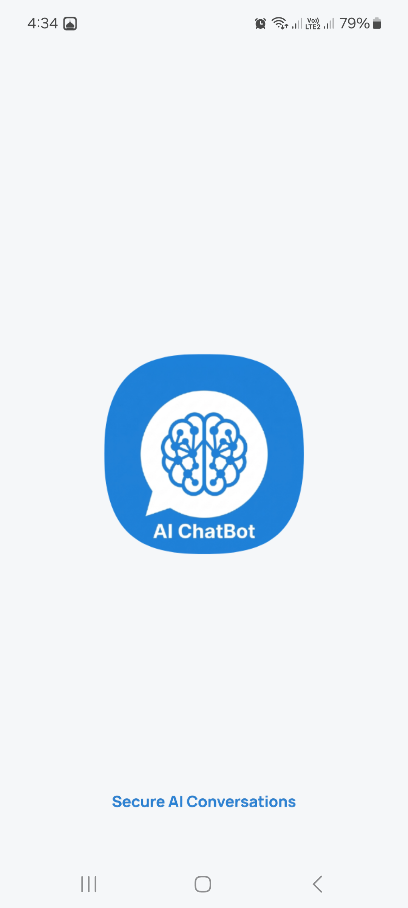
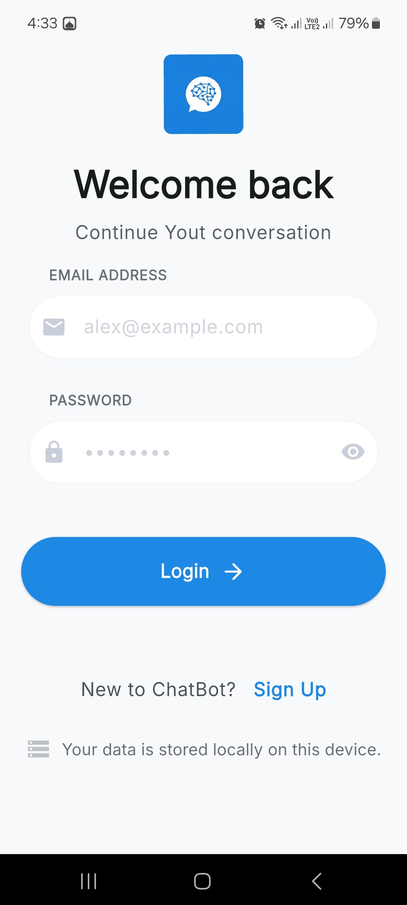
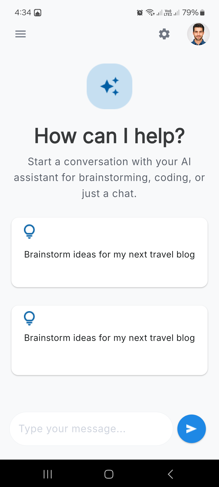
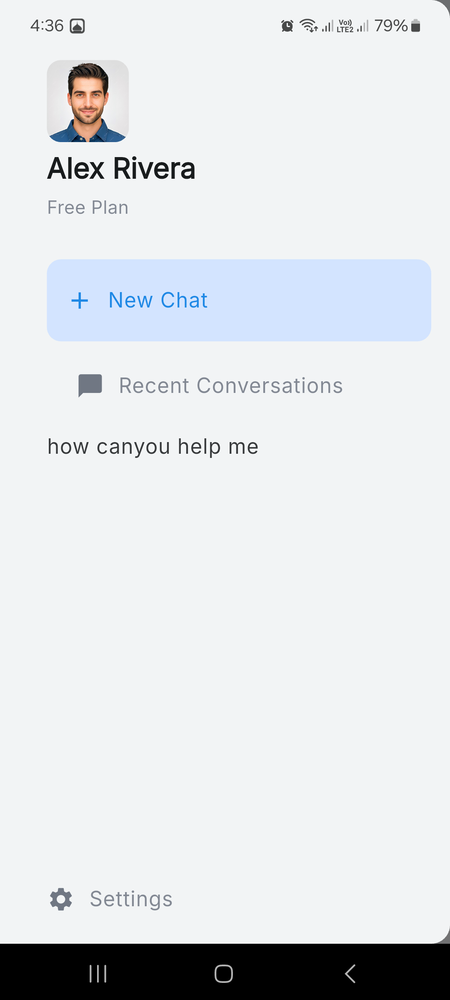
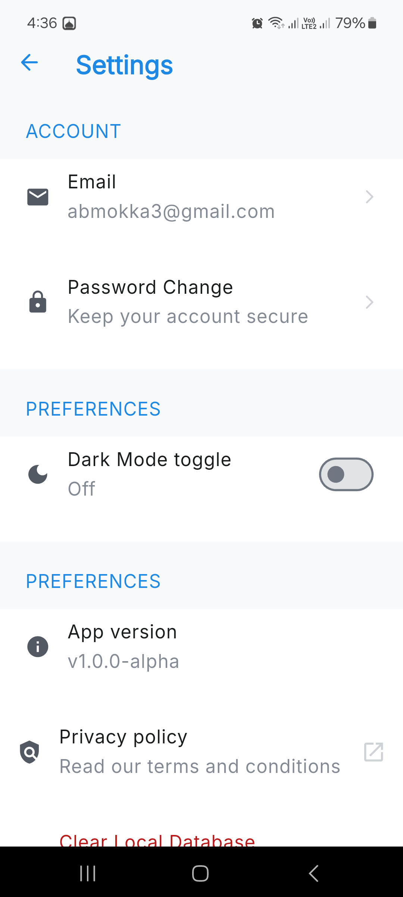
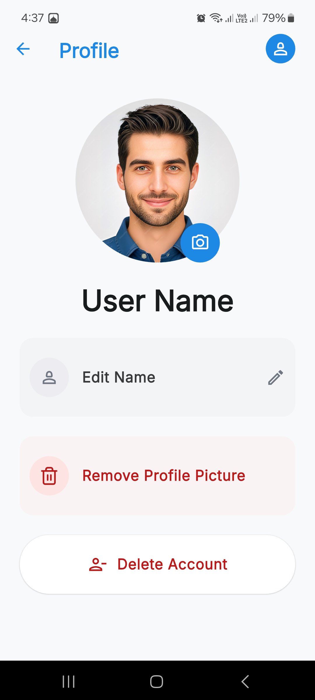

# 🤖 AI ChatBot

<p align="center">
  
</p>

<p align="center">
  A modern AI-powered chatbot mobile application built with <strong>Flutter</strong>, featuring a clean and responsive UI, local chat history, user profile management, and an AI model served through a Python API.
</p>

## ✨ Features

- 🔐 User authentication with login and sign-up
- 🤖 AI-powered conversations
- 💬 Previous conversations and chat history
- 👤 Profile page and profile picture management
- 📷 Set profile picture using the camera or gallery
- 🔐 Runtime permission handling for camera and internet access
- 🗑️ Clear stored conversations/data
- ❌ Complete account deletion
- 📧 Email and password management
- 🌙 Light and dark themes
- 📜 Privacy Policy
- 🎨 Custom app icon and splash screen
- ✨ Smooth animations throughout the app
- 🔔 Improved dialogs and user feedback
- 💾 Local data storage
- 🌐 API connectivity and internet-connection handling

## 🛠️ Tech Stack

### Mobile App
- **Flutter / Dart**
- **GetX** — state management and navigation
- **SQLite (sqflite)** — local data storage
- **HTTP** — API communication
- **Inter** — application-wide font
- **Lucide Icons** — icons
- **Image Picker** — camera/gallery image selection
- **Path Provider** — local file handling
- **URL Launcher** — opening external links
- **Flutter Native Splash** — custom splash screen

### AI / Backend
- **Python**
- **FastAPI**
- **TensorFlow / Keras**
- Intent-based text classification model

## 🏗️ Project Structure

```text
ai_chatbot_colab/
├── ai_model/
├── android/
├── assets/
├── ios/
├── lib/
│   ├── binding/
│   ├── controllers/
│   ├── middleware/
│   ├── services/
│   ├── theme/
│   ├── utilities/
│   └── view/
├── test/
├── web/
└── main.dart
```

## 📱 Screenshots

<!-- Keep this section concise: Splash → Login → Home → Previous Chats → Settings → Profile -->

<p align="center">
  
  
  
  
  
  
</p>

## ✨ Features

* 🔐 User account creation and authentication
* 💬 AI-powered conversations
* 🗂️ Chat history management
* 🔄 Resume previous conversations from chat history
* 🗑️ Delete individual conversations
* 👤 Profile management
* 🖼️ Change or remove profile picture
* 📷 Select images from the camera or gallery
* 💾 Local data storage
* 🔒 Privacy-focused local data handling
* 🌙 Light and dark themes
* 🔑 Change account password
* 📧 Change account email
* 🗑️ Delete the entire user account
* 📄 Built-in Privacy Policy
* ✉️ Contact the developer through email
* 🎨 Custom UI with animations
* 📱 Responsive Flutter interface

---

## 🛠️ Technologies & Packages

### Flutter & Dart

The application was developed using **Flutter and Dart**.

### State Management & Application Architecture

* **GetX** — Used as an integrated solution throughout the application, including:

  * State management
  * Navigation
  * Dependency management
  * Application-level utilities

### Local Storage

* **sqflite** — Local SQLite database for storing application data.
* **path** — Handling database and file system paths.
* **path_provider** — Accessing application directories on the device.

The application relies heavily on local storage, which helps keep user data on the device and supports a privacy-focused approach.

### Networking & API

* **http** — Used to communicate between the Flutter application and the backend API.

The Flutter application communicates with a Python-based backend that provides access to the AI model.

### UI & Icons

* **Cupertino Icons** — iOS-style icons.
* **Lucide Icons** — Additional modern icons not available in the default Flutter icon set.
* **TweenAnimationBuilder** — Used to create custom UI animations and transitions.

### Image Handling

* **image_picker** — Used for selecting images from:

  * Camera
  * Device gallery

### External Links

* **url_launcher** — Used for opening external links, including the developer's email contact and other external resources.

### App Launch & Branding

* **flutter_native_splash** — Used to customize the application's splash screen and branding.
* **flutter_launcher_icons** — Used to generate application launcher icons for Android and iOS.

### Development Tools

* **flutter_lints** — Recommended Dart and Flutter lint rules.
* **flutter_test** — Flutter testing framework.

---

## 🤖 AI & Backend

The AI system is powered by a machine-learning model developed using **Python**.

The project is divided into two main parts:

```text
Flutter Application
       │
       │ HTTP Requests
       ▼
Python Backend API
       │
       ▼
AI Model
       │
       ▼
Generated Response
```

### Flutter Side

The Flutter application handles:

* User interface
* User interactions
* Chat interface
* API communication
* Local data storage
* User settings
* Profile management
* Image handling
* Authentication-related screens
* Theme management

### Python Side

The Python backend handles:

* API endpoints
* AI model loading
* Processing user messages
* Generating AI responses
* Communication between the Flutter application and the AI model

---

## 🔒 Privacy

Privacy was an important consideration during the development of the application.

User-related application data is stored **locally on the device**, reducing the need to send unnecessary personal data to external services.

The application also provides a dedicated **Privacy Policy** explaining how data is handled.

---

## 🎨 UI & User Experience

The application was designed with a focus on providing a clean and simple user experience.

The Flutter UI includes custom layouts, reusable styling, responsive elements, and animations.

One of the animation techniques used in the application is Flutter's:

```dart
TweenAnimationBuilder
```

which was used to create smooth UI animations without relying on an external animation package.

---

## 🚀 Getting Started

### Prerequisites

Make sure you have the following installed:

* Flutter SDK
* Dart SDK
* Android Studio or another Flutter-compatible IDE
* A connected Android/iOS device or emulator
* Python environment for running the backend

### Installation

Clone the repository:

```bash
git clone <repository-url>
```

Navigate to the project:

```bash
cd <project-folder>
```

Install Flutter dependencies:

```bash
flutter pub get
```

Run the application:

```bash
flutter run
```

### Backend

The AI backend must also be running for the chatbot functionality to work.

The Flutter application communicates with the Python backend through its API endpoint.

> Configure the API endpoint according to your local/server environment before running the application.

---

## 👥 Contributors

### Abdalla-Medhat

**Flutter Developer**

Responsible for:

* Complete Flutter UI implementation
* Application screens and user experience
* GetX application architecture
* API integration from the Flutter side
* Local SQLite database integration
* Local data management
* Image handling using camera and gallery
* Theme system and Light/Dark mode
* UI animations
* Profile and account management
* Chat history functionality
* Settings and privacy-related screens
* API communication and error handling

GitHub: [@Abdalla-Medhat](https://github.com/Abdalla-Medhat)

### Don-Youssef

**AI / Backend Developer**

Responsible for:

* AI model development
* Model training and preparation
* Python backend
* API endpoints
* AI model integration with the backend
* Backend-side processing of chatbot requests

GitHub: [@Don-Youssef](https://github.com/Don-Youssef)

---

## 📦 Main Dependencies

| Package                  | Purpose                                                                        |
| ------------------------ | ------------------------------------------------------------------------------ |
| `get`                    | State management, navigation, dependency management, and application utilities |
| `sqflite`                | Local SQLite database                                                          |
| `path`                   | File and database paths                                                        |
| `path_provider`          | Application storage directories                                                |
| `http`                   | API communication                                                              |
| `lucide_icons`           | Additional icons                                                               |
| `url_launcher`           | Opening external links and email                                               |
| `image_picker`           | Camera and gallery image selection                                             |
| `flutter_native_splash`  | Splash screen and branding                                                     |
| `flutter_launcher_icons` | Application launcher icons                                                     |
| `cupertino_icons`        | iOS-style icons                                                                |
| `flutter_lints`          | Dart/Flutter linting                                                           |
| `flutter_test`           | Testing                                                                        |

---

## 📄 License

This project is developed for educational and portfolio purposes.

---

## 📬 Contact

For questions, feedback, or suggestions, please use the contact information provided within the application.
